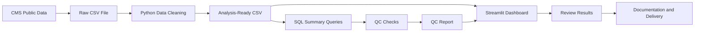

# Project Workflow

This project uses CMS public Medicare Advantage Geographic Variation data to create an analysis-ready dataset, SQL summary outputs, QC checks, and a Streamlit dashboard.

The goal is not only to build a dashboard, but also to show a professional healthcare data workflow: source data review, cleaning, analysis, quality control, documentation, and delivery.

## High-Level Workflow



## Workflow Explanation

### 1. CMS Public Data

The source data comes from CMS public Medicare Advantage Geographic Variation data.

### 2. Raw CSV File

The downloaded CMS file is stored as the raw source file. Raw files are not changed directly.

### 3. Python Data Cleaning

Python is used to clean and prepare the data. CMS suppressed values such as `*` are converted to missing values, and selected fields are converted to numeric types.

### 4. Analysis-Ready CSV

The cleaned dataset is saved in the `data_processed` folder and becomes the main input for SQL summaries and dashboard reporting.

### 5. SQL Summary Queries

SQL files are used to summarize Medicare Advantage enrollment and utilization by state and year.

### 6. QC Checks

Quality control checks are used to validate the output. These checks include row counts, missing key values, duplicate state-year records, beneficiary count checks, and missing utilization values.

### 7. Streamlit Dashboard

The dashboard reads the analysis-ready CSV and displays key measures, charts, and state-level tables.

### 8. Review and Delivery

The final project is reviewed and documented so the workflow can be understood by analysts, programmers, project managers, and interviewers.
```
